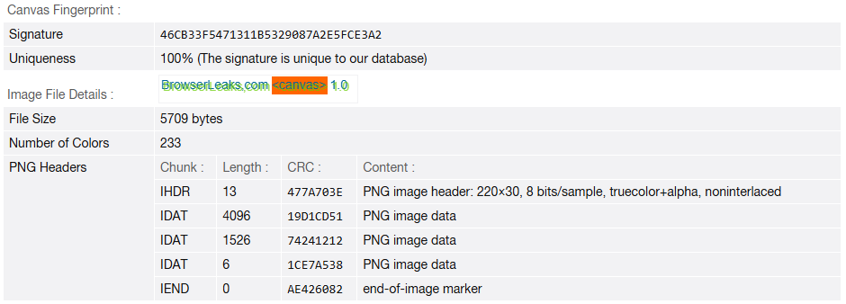
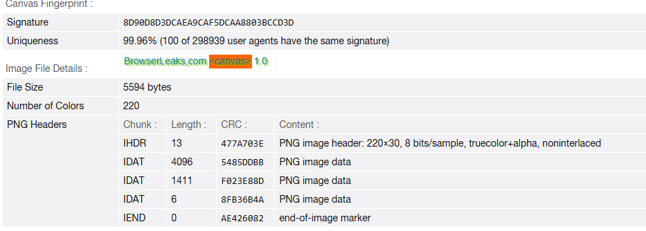

# Low-Profile-Fingerprint

[](LICENSE)
[](https://github.com/Devzinh/Low-Profile-Fingerprint/issues)
[](#installation)
[](#)

<p align="center">
  
</p>

Userscript v1.2.0 that reduces browser fingerprint uniqueness with lightweight per-session noise and defensive normalization based on real environment data.

**Portuguese version:** [README.md](README.md)

## Table of Contents

- [Overview](#overview)
- [How it works](#how-it-works)
- [How Signals are Handled](#how-signals-are-handled)
- [Analogy](#analogy)
- [Features](#features)
- [Installation](#installation)
- [Quick test](#quick-test)
- [Canvas — Before and After](#canvas--before-and-after)
- [Suggested metadata](#suggested-metadata)
- [Limitations](#limitations)
- [Use cases](#use-cases)
- [Contributing](#contributing)
- [Roadmap](#roadmap)
- [Support](#support)
- [License](#license)

## Overview

**Low-Profile-Fingerprint** is a privacy-focused userscript designed to make common browser fingerprinting techniques harder to use without relying on aggressive blocking or breaking browser APIs. Instead of trying to completely erase browser identity, the script reduces highly specific signals and adds small plausible variations per session.

The goal is simple: make the browser look less unique to systems that try to identify users through characteristics such as screen properties, timezone, canvas, WebGL, fonts, plugins, battery, and connection data.

## How it works

The script runs at `document-start`, before many fingerprinting checks happen, and applies defensive adjustments to browser APIs commonly used for identification.

Signals handled by the script include:

- `screen` (width, height, available area, color depth)
- `navigator` (hardware concurrency, device memory, plugins, and mimeTypes)
- `timezone` (`getTimezoneOffset` and `Intl.DateTimeFormat().resolvedOptions()`)
- `canvas` (`getImageData`, `toDataURL`, `toBlob`)
- `audio` (`AudioBuffer.getChannelData` and `AnalyserNode.getFloatFrequencyData`)
- `fonts` through lightweight noise in text measurements
- `connection` (`rtt`, `downlink`, `effectiveType`, `type`)
- `speechSynthesis` (voice list normalization)
- `battery` (facade for Battery API properties)
- `WebGL` (vendor, renderer, selected parameters, and `readPixels`)

This approach follows a defensive anti-fingerprinting strategy based on normalization and lightweight noise: reducing stability and uniqueness of exposed signals without making the browser obviously fake or internally inconsistent.

Since v1.2.0, the script avoids invented profiles: signals such as WebGL, connection, plugins, mimeTypes, and voices are read from the real browser and only normalized, ordered, bucketed, or softened deterministically.

## How Signals are Handled

| API / Feature | Method Used | Privacy Objective |
| :--- | :--- | :--- |
| **Canvas 2D** | Dynamic Noise Injection | Minor adjustments to pixel channels to yield unique canvas hash signatures per session. |
| **WebGL** | Real Value Normalization & Noise | Reads real `VENDOR` and `RENDERER` values through standard WebGL, normalizes/truncates the strings, and adds WebGL pixel buffer noise through `readPixels`. |
| **Screen & Window** | Coherent Bucketing | Buckets real screen dimensions and derives the available area from normalized real values. |
| **Navigator plugins / mimeTypes** | Real Entropy Reduction | Uses only real browser entries, with normalization, deduplication, and deterministic ordering. |
| **Speech voices** | Deterministic Ordering | Reorders real voices by session seed without fabricating unavailable voices or applying a fixed cap. |
| **Audio / Fonts** | Measurement Noise | Adds micro-variations to font dimension and audio output APIs without breaking functionality. |
| **Battery** | Defensive Facade | Reduces variable Battery API telemetry to less identifying values. |
| **Connection** | Real Value Bucketing | Buckets real `rtt` and `downlink` values and preserves real `type`/`effectiveType` when the API exists. |

## Analogy

Imagine visiting a website as entering a mall where a security guard tries to recognize each visitor by their clothes, the way they walk, their watch, and the details of their shoes. Browser fingerprinting works in a similar way: instead of asking for your name, it observes technical browser traits to decide whether it has "seen you before."

**Low-Profile-Fingerprint** works like a light, consistent disguise. You still enter normally, but with less unique details and small per-session changes, making you look more like "just another regular person" than someone easy to recognize from a distance.

## Features

- Early execution with `@run-at document-start`
- Lightweight and consistent per-session noise
- Defensive normalization across multiple browser APIs
- No hardcoded lists of invented hardware, plugins, connection data, or voices
- Wrappers protected against duplicate application with reduced exposure through `Function.prototype.toString`
- Configuration menu for enabling and disabling patches
- Compatibility with userscript managers such as Tampermonkey

## Installation

You can install the latest version directly from the repository:

- [Install via Tampermonkey / Userscript manager](https://raw.githubusercontent.com/Devzinh/Low-Profile-Fingerprint/main/low-profile-fingerprint.user.js)

Manual steps:

1. Install a userscript manager such as Tampermonkey or Violentmonkey.
2. Enable the option to allow user scripts in the browser or extension if prompted.
3. Open the `low-profile-fingerprint.user.js` file.
4. Install the script through your userscript manager.
5. Reload the pages where you want to test its behavior.

## Quick test

1. Install the script normally.
2. Visit one of the recommended test tools listed below.
3. Compare browser behavior with and without the script enabled.
4. Check for possible differences in canvas, WebGL, timezone, and other exposed signals.

### Recommended test tools

- **[BrowserLeaks](https://browserleaks.com/)**: Great for testing specific signatures like Canvas, WebGL, fonts, and battery/geolocation APIs.
- **[CreepJS](https://abrahamjuliot.github.io/creepjs/)**: One of the most advanced tools for testing noise robustness and checking if APIs look simulated or genuine.
- **[Cover Your Tracks (EFF)](https://coveryourtracks.eff.org/)**: Tool developed by the Electronic Frontier Foundation to evaluate your overall tracking index and uniqueness.

## Canvas — Before and After

Test performed on [BrowserLeaks Canvas](https://browserleaks.com/canvas) comparing behavior with and without the script active.

| Field | With script | Without script |
|---|---|---|
| **Signature** | `8D90D8D3DCAEA9CAF5DCAA8803BCCD3D` | `46CB33F5471311B5329087A2E5FCE3A2` |
| **Uniqueness** | 99.96% | **100% (unique in database)** |
| **File Size** | 5594 bytes | 5709 bytes |
| **Number of Colors** | 220 | 233 |

### Without the script

<p align="center">
  
</p>

### With the script

<p align="center">
  
</p>

**What this shows:**

- The signatures are completely different — the noise injected into the canvas effectively alters the hash.
- Without the script, the canvas is 100% unique in BrowserLeaks' database, meaning it is trivially trackable.
- With the script, the site sees a different signature from the real one, making identification harder.
- The difference in File Size and Number of Colors confirms that the pixels were actually altered by the patch.

> Test performed with Comet/Chrome/Firefox on Windows 11. Results may vary by browser and hardware.

## Suggested metadata

```javascript
// ==UserScript==
// @name         Low-Profile-Fingerprint
// @namespace    https://github.com/Devzinh/Low-Profile-Fingerprint
// @version      1.2.0
// @description  Disfarça seu navegador: normaliza sinais comuns de fingerprint e adiciona ruído leve por sessão para reduzir rastreamento sem quebrar sites.
// @author       Rony Gabriel
// @homepageURL  https://github.com/Devzinh/Low-Profile-Fingerprint
// @supportURL   https://github.com/Devzinh/Low-Profile-Fingerprint/issues
// @updateURL    https://github.com/Devzinh/Low-Profile-Fingerprint/raw/main/low-profile-fingerprint.user.js
// @downloadURL  https://github.com/Devzinh/Low-Profile-Fingerprint/raw/main/low-profile-fingerprint.user.js
// @license      MIT
// @match        *://*/*
// @run-at       document-start
// @grant        unsafeWindow
// @grant        GM_getValue
// @grant        GM_setValue
// @grant        GM_registerMenuCommand
// ==/UserScript==
```

## Limitations

This project does not guarantee total anonymity. Browser fingerprinting combines many different signals, and poorly calibrated anti-fingerprinting techniques can sometimes make a browser more identifiable when they create rare or inconsistent patterns.

Some websites may also react unexpectedly to changes in APIs such as canvas, WebGL, audio, timezone, or battery, especially applications that are highly sensitive to graphics environment, audio processing, or hardware detection.

## Use cases

- Practical study of browser fingerprinting
- Portfolio project focused on privacy and security
- Defensive userscript experiments
- Exploration of browser APIs and signal normalization

## Contributing

Suggestions, issues, and pull requests are welcome.

If you want to contribute, you can:
- report site incompatibilities
- suggest new patches
- improve the documentation
- propose compatibility and privacy adjustments

## Roadmap

- Add domain exclusions
- Create balanced mode and strict mode
- Improve technical documentation for each patch
- Publish installable releases
- Add site compatibility tests

## Support

- [Open an issue](https://github.com/Devzinh/Low-Profile-Fingerprint/issues)

## License

MIT
